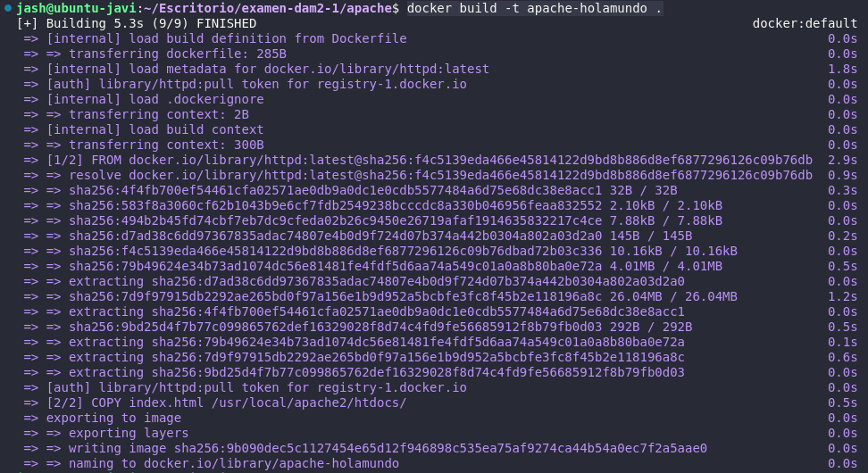
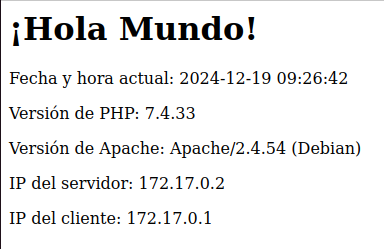

# Sprint 1

1. Para comprobar que se pueden hacer `commit` y `push` al repositorio usaremos `git add .`, `git commit -m "Prueba de commit"` y `git push` y nos saldrá la siguiente imagen:


2. Para comprobar que tenemos la sesión iniciada en docker hub debemos meter el comando `docker login` y nos saldrá algo como esto:


# Sprint 2

1. He creado una carpeta llamada `apache` donde he creado el archivo `Dockerfile`.
2. En el archivo `Dockerfile` he añadido lo siguiente:

```Dockerfile
# Usar la imagen base oficial de Apache
FROM httpd:latest

# Copiar el archivo index.html al directorio adecuado en el contenedor
COPY index.html /usr/local/apache2/htdocs/

# Exponer el puerto 80 para que el servidor web sea accesible
EXPOSE 80
```
y he creado el siguiente `index.html`:

```HTML
<!DOCTYPE html>
<html lang="en">
<head>
    <meta charset="UTF-8">
    <meta name="viewport" content="width=device-width, initial-scale=1.0">
    <title>Hello World</title>
</head>
<body>
    <h1>HEYYYYYYYYYYYYYYYYY OLVIDONAAAAAAAAAAAAAAAAA</h1>
</body>
</html>
```
3. Para crear la imagen necesitamos el comando `docker build -t apache-holamundo .` donde nos saldrá lo siguiente en la terminal:



y para lanzar el repositorio de forma local necesitamos el comando `docker run -p 8080:80 apache-holamundo` y se comprueba escribiendo en el navegador `http://localhost:8080/`.

# Sprint 3

1. He copiado la carpeta `apache` y a la nueva copia la he renombrado como `apache-php`.
2. He hecho ue el servidor web Apache sirva un archivo `index.php`. Para ello, he modificado el archivo `Dockerfile` con lo siguiente:

```Dockerfile
# Usa una imagen base con Apache y PHP
FROM php:7.4-apache

# Instala el módulo de Apache para que soporte PHP
RUN docker-php-ext-install mysqli && a2enmod rewrite

# Copia el archivo index.php al contenedor
COPY index.php /var/www/html/

# Expone el puerto 80
EXPOSE 80
```
y en el archivo `index.php` he tenido que añadir lo siguiente:

```php
<?php
echo "<h1>¡Hola Mundo!</h1>";
echo "<p>Fecha y hora actual: " . date("Y-m-d H:i:s") . "</p>";
echo "<p>Versión de PHP: " . phpversion() . "</p>";
echo "<p>Versión de Apache: " . apache_get_version() . "</p>";
echo "<p>IP del servidor: " . $_SERVER['SERVER_ADDR'] . "</p>";
echo "<p>IP del cliente: " . $_SERVER['REMOTE_ADDR'] . "</p>";
?>
```

3. He creado la imagen con el comando `docker build -t apache-php-server .` y he lanzado el contenedor de forma local con `docker run -p 8080:80 apache-php-server` y comprobado mediante la URL `http://localhost:8080/` obteniendo como resultado lo siguiente:

