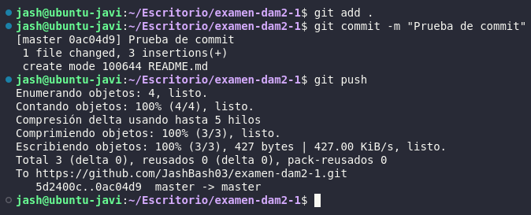
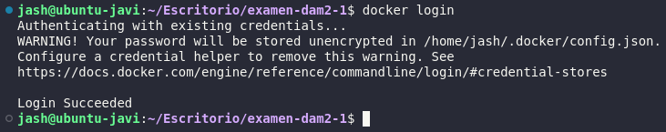

# Sprint 1

1. Para comprobar que se pueden hacer `commit` y `push` al repositorio usaremos `git add .`, `git commit -m "Prueba de commit"` y `git push` y nos saldrá la siguiente imagen:

2. Para comprobar que tenemos la sesión iniciada en docker hub debemos meter el comando `docker login` y nos saldrá algo como esto:

# Sprint 2