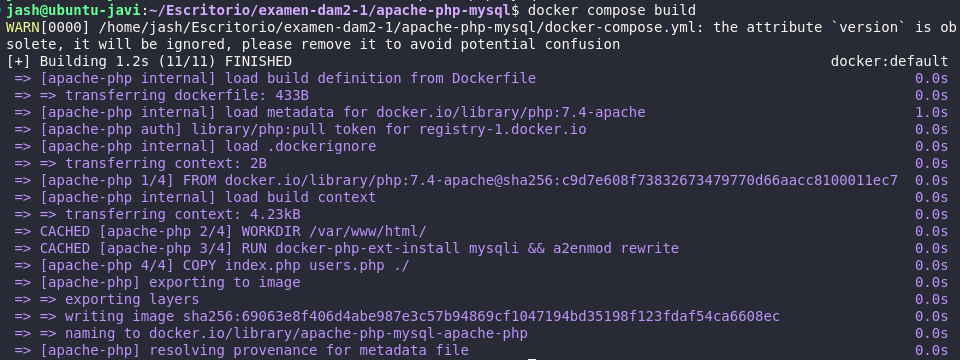

# Sprint 1

1. Para comprobar que se pueden hacer `commit` y `push` al repositorio usaremos `git add .`, `git commit -m "Prueba de commit"` y `git push` y nos saldrá la siguiente imagen:


2. Para comprobar que tenemos la sesión iniciada en docker hub debemos meter el comando `docker login` y nos saldrá algo como esto:


# Sprint 2

1. He creado una carpeta llamada `apache` donde he creado el archivo `Dockerfile`.
2. En el archivo `Dockerfile` he añadido lo siguiente:

```Dockerfile
# Usar la imagen base oficial de Apache
FROM httpd:latest

# Copiar el archivo index.html al directorio adecuado en el contenedor
COPY index.html /usr/local/apache2/htdocs/

# Exponer el puerto 80 para que el servidor web sea accesible
EXPOSE 80
```
y he creado el siguiente `index.html`:

```HTML
<!DOCTYPE html>
<html lang="en">
<head>
    <meta charset="UTF-8">
    <meta name="viewport" content="width=device-width, initial-scale=1.0">
    <title>Hello World</title>
</head>
<body>
    <h1>HEYYYYYYYYYYYYYYYYY OLVIDONAAAAAAAAAAAAAAAAA</h1>
</body>
</html>
```
3. Para crear la imagen necesitamos el comando `docker build -t apache-holamundo .` donde nos saldrá lo siguiente en la terminal:


y para lanzar el repositorio de forma local necesitamos el comando `docker run -p 8080:80 apache-holamundo` y se comprueba escribiendo en el navegador `http://localhost:8080/`.

# Sprint 3

1. He copiado la carpeta `apache` y a la nueva copia la he renombrado como `apache-php`.
2. He hecho ue el servidor web Apache sirva un archivo `index.php`. Para ello, he modificado el archivo `Dockerfile` con lo siguiente:

```Dockerfile
# Usa una imagen base con Apache y PHP
FROM php:7.4-apache

# Instala el módulo de Apache para que soporte PHP
RUN docker-php-ext-install mysqli && a2enmod rewrite

# Copia el archivo index.php al contenedor
COPY index.php /var/www/html/

# Expone el puerto 80
EXPOSE 80
```
y en el archivo `index.php` he tenido que añadir lo siguiente:

```php
<?php
echo "<h1>¡Hola Mundo!</h1>";
echo "<p>Fecha y hora actual: " . date("Y-m-d H:i:s") . "</p>";
echo "<p>Versión de PHP: " . phpversion() . "</p>";
echo "<p>Versión de Apache: " . apache_get_version() . "</p>";
echo "<p>IP del servidor: " . $_SERVER['SERVER_ADDR'] . "</p>";
echo "<p>IP del cliente: " . $_SERVER['REMOTE_ADDR'] . "</p>";
?>
```

3. He creado la imagen con el comando `docker build -t apache-php-server .` y he lanzado el contenedor de forma local con `docker run -p 8080:80 apache-php-server` y comprobado mediante la URL `http://localhost:8080/` obteniendo como resultado lo siguiente:


# Sprint 4


1. Sigo en la carpeta apache-php.

2. He creado un archivo info.php implementando la funcion phpinfo():

```php
<?php
phpinfo();
?>
```
3. Creamos un archivo random.php, que devuelva un JSON con lo siguiente:
- Un número aleatorio entre 1 y 100.
- Un mensaje que diga si el número es par o impar.
- Un elemento aleatorio de un array que contenga al menos 5 elementos, a tu elección.

```php
<?php
// Generar un número aleatorio entre 1 y 100
$randomNumber = rand(1, 100);

// Determinar si el número es par o impar
$isEvenOrOdd = ($randomNumber % 2 === 0) ? "par" : "impar";

// Crear un array con al menos 5 elementos
$array = ["manzana", "banana", "cereza", "uva", "naranja"];

// Elegir un elemento aleatorio del array
$randomElement = $array[array_rand($array)];

// Crear el arreglo de resultados
$result = [
    "numero" => $randomNumber,
    "es_par_o_impar" => $isEvenOrOdd,
    "elemento_aleatorio" => $randomElement
];

// Devolver los resultados como JSON
header('Content-Type: application/json');
echo json_encode($result);
?>
```

4. Lanzarla localmente para comprobar que funciona.

Para construir la imagen hace falta `docker build -t apache-php-random` y para lanzar el contenedor hace falta `docker run -p 8080:80 apache-php-random`

Accedo a `http://localhost:8080` para comprobar que funciona, en la siguiente ruta muestra el archivo random `http://localhost:8080/random.php` y en esta la información de php `http://localhost:8080/info.php`.

# Sprint 5

1. Creo una nueva carpeta `apache-php-mysql` y creo el archivo `docker-compose.yml`. Dentro del archivo añado lo siguiente:

```yml
# Configuracion archivo .yml
version: '3.8'

services:
  apache-php:
    build: ./apache-php
    ports:
      - "8080:80"
    networks:
      - app-network
    depends_on:
      - mysql

  mysql:
    image: mysql:5.7
    environment:
      MYSQL_ROOT_PASSWORD: rootpassword
      MYSQL_DATABASE: mydb
      MYSQL_USER: user
      MYSQL_PASSWORD: userpassword
    volumes:
      - ./init.sql:/docker-entrypoint-initdb.d/init.sql
    networks:
      - app-network

networks:
  app-network:
    driver: bridge


# Construir contenedores con docker compose
# docker-compose build

# Lanzar los contenedores
# docker-compose up -d

# Detener los contenedores 
# docker-compose down

# Construir imagen para subirla
# docker build -t <tu_usuario>/apache-php-mysql .

# SUbir la imagen
# docker push <tu_usuario>/apache-php-mysql

```
2. Creo un archivo `init.sql` que contiene la creacion de una base de datos y una tabla de usuarios con los campos `id`, `name` y `password`.

3. Inserta varios usuarios dentro del `init.sql`.

```SQL
CREATE DATABASE IF NOT EXISTS db(d);

USE db(d);

CREATE TABLE IF NOT EXISTS users (
    id INT AUTO_INCREMENT PRIMARY KEY,
    name VARCHAR(255) NOT NULL,
    password VARCHAR(255) NOT NULL
);

INSERT INTO users (name, password) VALUES ('Javi', '1234');
INSERT INTO users (name, password) VALUES ('Alvaro', 'wapeton04');
INSERT INTO users (name, password) VALUES ('Ivoooooo', '18camachops');
```
4. Copio la carpeta `apache-php` a la carpeta actual y modifico el `index.php` añadiendo en la parte de arriba el siguiente código:

```php
// Datos de la base de datos
$servername = "mysql";
$username = "user";
$password = "userpassword";
$dbname = "mydb";

// Crear conexión con la base de datos
$conn = new mysqli($servername, $username, $password, $dbname);

// Verificar conexión
if ($conn->connect_error) {
    die("Conexión fallida: " . $conn->connect_error);
}
```
5. Creo un archivo `users.php` que muestre todos los usuarios de la tabla `users` en la base de datos con el siguiente código:

```php
<?php
$servername = "mysql";
$username = "user";
$password = "userpassword";
$dbname = "mydb";

$conn = new mysqli($servername, $username, $password, $dbname);

if ($conn->connect_error) {
    die("Conexión fallida: " . $conn->connect_error);
}

$sql = "SELECT id, name, password FROM users";
$result = $conn->query($sql);

if ($result->num_rows > 0) {
    // Salida de los datos de cada fila
    while($row = $result->fetch_assoc()) {
        echo "id: " . $row["id"]. " - Nombre: " . $row["name"]. " - Contraseña: " . $row["password"]. "<br>";
    }
} else {
    echo "0 resultados";
}
$conn->close();
?>
```
6. Para lanzar la imagen necesitaremos el comando `docker-compose build` lo que nos dará la siguiente situación:



y el siguiente comando `docker-compose up -d` es para iniciar de forma local el contenedor. Se comprueba con la URL `http://localhost:8080`.

7. Creo una imagen en `docker hub` con el entorno que he creado con el siguiente código:
```
docker build -t jashbash03/apache-php-mysql ./apache-php
```

8. Subo la imagen a `docker hub` con el siguiente código:
```
docker push jashbash03/apache-php-mysql
```

9. Compruebo la descarga con el siguiente código:
```
docker compose up
```